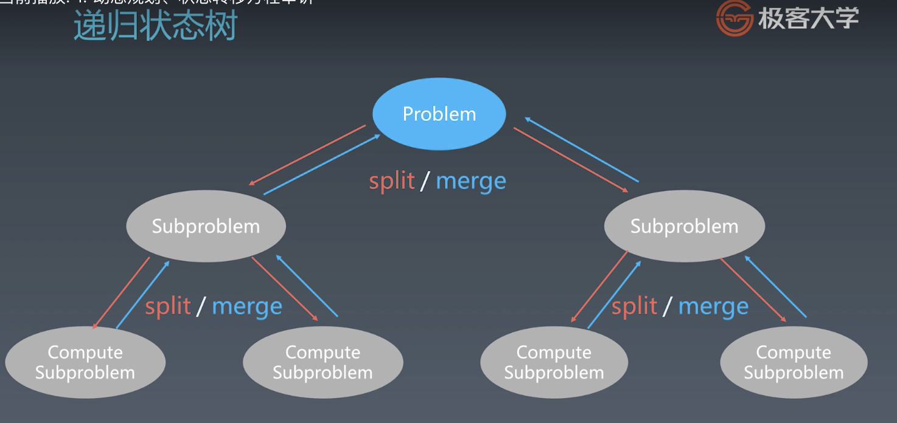
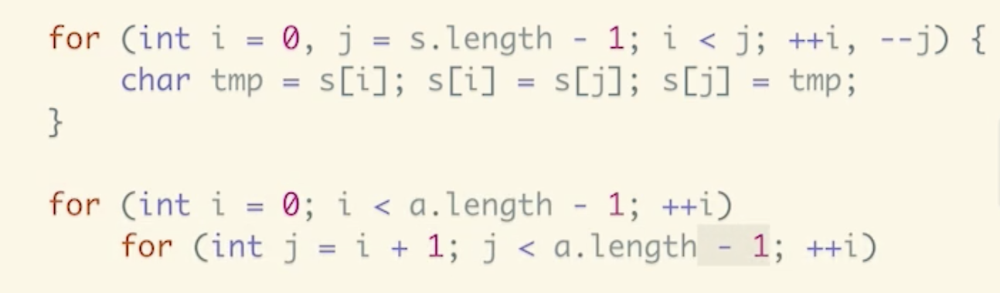

## 高级动态规划

### 递归-函数自己调用自己

```java
public void recur(int level, int param) {
    //terminator
    if (level > MAX_LEVEL) {
        //process result
        return;
    }

    //process current logic
    process(level, param);

    //drill down
    recur(level: level + 1, newParam);

    // restore current status
}
```

### 分治(分而治之)

```python
def divide_conquer(problem, param1, param2, ...) :
    # recursion terminator  递归终止条件
    if problem is None:
        print_result
        return

    # prepare data  准备数据和拆分问题
    data = prepare_data(problem)
    subproblems = split_problem(problem, data)


    # conquer subproblems  调用分治函数进行求解
    subresult1 = self.divide_conquer(subproblem[0], p1, ...)
    subresult2 = self.divide_conquer(subproblem[1], p1, ...)
    subresult3 = self.divide_conquer(subproblem[2], p1, ...)
    
    ...

    # process and generate the final result  合并结果
    result = process_result(subresult1, subresult2, subresult3, ...)

    # revert the current level states  返回
```

### 感触

```mark
1.人肉递归,低效
2.找到最近最简方法,将其拆成可重复解决问题  ---最近重复性 (想成最大公约数)
3.数学归纳法思想 --- 

本质: 寻找重复性-->计算机指令集
```

### 递归状态树



```mark
动态规划 = 分治+最优子结构(就看有没有最优子结构)
拥有共性：找到重复子问题
差异性：最优子结构、中途可以淘汰次优解 
```

### DP顺推模板

```java
function DP():

    dp = [][]  # 二维情况

    for i = 0 .. M {
        for j = 0 .. N {
            dp[i][j] = _Function(dp[j'][j']);
        }
    }

    return dp[M][N];
```


### 参考链接

- [爬楼梯](https://leetcode-cn.com/problems/climbing-stairs/)（阿里巴巴、腾讯、字节跳动在半年内面试常考）
- [不同路径](https://leetcode-cn.com/problems/unique-paths/)（亚马逊、微软、Facebook 在半年内面试中考过）
- [打家劫舍](https://leetcode-cn.com/problems/house-robber/)（字节跳动、谷歌、苹果在半年内面试中考过）
- [最小路径和](https://leetcode-cn.com/problems/minimum-path-sum/)（字节跳动、谷歌、亚马逊在半年内面试中考过）
- [股票买卖](https://leetcode-cn.com/problems/best-time-to-buy-and-sell-stock/)（字节跳动、亚马逊、Facebook 在半年内面试常考）

#### 课后作业

在学习总结中，写出[不同路径 2 ](https://leetcode-cn.com/problems/unique-paths-ii/)这道题目的状态转移方程。

### 参考链接

- [爬楼梯](https://leetcode-cn.com/problems/climbing-stairs/)（阿里巴巴、腾讯、字节跳动在半年内面试常考）
- [使用最小花费爬楼梯](https://leetcode-cn.com/problems/min-cost-climbing-stairs/)（亚马逊在半年内面试中考过）
- [编辑距离](https://leetcode-cn.com/problems/edit-distance/)（字节跳动、亚马逊、谷歌在半年内面试中考过）

#### 课后作业

- [最长上升子序列](https://leetcode-cn.com/problems/longest-increasing-subsequence/)（字节跳动、亚马逊、微软在半年内面试中考过）
- [解码方法](https://leetcode-cn.com/problems/decode-ways/)（Facebook、亚马逊、字节跳动在半年内面试中考过）
- [最长有效括号](https://leetcode-cn.com/problems/longest-valid-parentheses/)（华为、亚马逊、字节跳动在半年内面试中考过）
- [最大矩形](https://leetcode-cn.com/problems/maximal-rectangle/)（谷歌、微软、字节跳动在半年内面试中考过）
- [不同的子序列](https://leetcode-cn.com/problems/distinct-subsequences/)（MathWorks 在半年内面试中考过）
- [赛车](https://leetcode-cn.com/problems/race-car/)（谷歌在半年内面试中考过）


## 字符串算法

```java
java:
String x = "abbc";
for (int i = 0; i < x.size(); ++i) {
    char ch = x.charAt(i);
}
for ch in x.toCharArray() {
    System.out.println(ch);
}

C++:

string x("abbc");

for (int i = 0; i < s1.length(); i++) {
    cout << x[i];
}
```

```java
字符串比较

-java

String x = "abb";

String y = "abb";

x == y --> false  比较指针

x.equals(y) --> true

x.equalsIgnoreCase(y) --> true
```





## 参考链接

- [不可变字符串](https://lemire.me/blog/2017/07/07/are-your-strings-immutable/)
- [Atoi 代码示例](https://shimo.im/docs/5kykuLmt7a4DdjSP)

## 字符串基础问题

- [转换成小写字母](https://leetcode-cn.com/problems/to-lower-case/)（谷歌在半年内面试中考过）
- [最后一个单词的长度](https://leetcode-cn.com/problems/length-of-last-word/)（苹果、谷歌、字节跳动在半年内面试中考过）
- [宝石与石头](https://leetcode-cn.com/problems/jewels-and-stones/)（亚马逊在半年内面试中考过）
- [字符串中的第一个唯一字符
  
  ](https://leetcode-cn.com/problems/first-unique-character-in-a-string/)（亚马逊、微软、Facebook 在半年内面试中考过）
- [字符串转换整数 (atoi) ](https://leetcode-cn.com/problems/string-to-integer-atoi/)（亚马逊、微软、Facebook 在半年内面试中考过）

## 字符串操作问题

- [最长公共前缀](https://leetcode-cn.com/problems/longest-common-prefix/description/)（亚马逊、谷歌、Facebook 在半年内面试中考过）
- [反转字符串](https://leetcode-cn.com/problems/reverse-string)（亚马逊、谷歌、苹果在半年内面试中考过）
- [反转字符串 II ](https://leetcode-cn.com/problems/reverse-string-ii/)（亚马逊在半年内面试中考过）
- [翻转字符串里的单词](https://leetcode-cn.com/problems/reverse-words-in-a-string/)（微软、字节跳动、苹果在半年内面试中考过）
- [反转字符串中的单词 III ](https://leetcode-cn.com/problems/reverse-words-in-a-string-iii/)（微软、字节跳动、华为在半年内面试中考过）
- [仅仅反转字母](https://leetcode-cn.com/problems/reverse-only-letters/)（字节跳动在半年内面试中考过）

## 异位词问题

- [有效的字母异位词
  
  ](https://leetcode-cn.com/problems/valid-anagram/)（Facebook、亚马逊、谷歌在半年内面试中考过）
- [字母异位词分组](https://leetcode-cn.com/problems/group-anagrams/)（亚马逊在半年内面试中常考）
- [找到字符串中所有字母异位词](https://leetcode-cn.com/problems/find-all-anagrams-in-a-string/)（Facebook 在半年内面试中常考）

## 回文串问题

- [验证回文串](https://leetcode-cn.com/problems/valid-palindrome/)（Facebook 在半年内面试中常考）
- [验证回文字符串 Ⅱ](https://leetcode-cn.com/problems/valid-palindrome-ii/)（Facebook 在半年内面试中常考）
- [最长回文子串](https://leetcode-cn.com/problems/longest-palindromic-substring/)（亚马逊、字节跳动、华为在半年内面试中常考）

## 最长子串、子序列问题

- [最长公共子序列](https://leetcode-cn.com/problems/longest-common-subsequence/)（亚马逊、字节跳动、谷歌在半年内面试中考过）
- [编辑距离](https://leetcode-cn.com/problems/edit-distance/)（亚马逊、字节跳动、谷歌在半年内面试中考过）
- [最长回文子串](https://leetcode-cn.com/problems/longest-palindromic-substring/)（亚马逊、华为、字节跳动在半年内面试常考）

## 字符串 +DP 问题

- [正则表达式匹配](https://leetcode-cn.com/problems/regular-expression-matching/)（Facebook、微软、字节跳动在半年内面试中考过）
- 题解：[ https://leetcode-cn.com/problems/regular-expression-matching/solution/ji-yu-guan-fang-ti-jie-gen-xiang-xi-de-jiang-jie-b/](https://leetcode-cn.com/problems/regular-expression-matching/solution/ji-yu-guan-fang-ti-jie-gen-xiang-xi-de-jiang-jie-b/)
- [通配符匹配](https://leetcode-cn.com/problems/wildcard-matching/)（Facebook、微软、字节跳动在半年内面试中考过）
- [不同的子序列](https://leetcode-cn.com/problems/distinct-subsequences/)（MathWorks 在半年内面试中考过）

## 参考链接

- [Boyer-Moore 算法](https://www.ruanyifeng.com/blog/2013/05/boyer-moore_string_search_algorithm.html)
- [Sunday 算法](https://blog.csdn.net/u012505432/article/details/52210975)
- [字符串匹配暴力法代码示例](https://shimo.im/docs/8G0aJqNL86wWrPUE)
- [Rabin-Karp 代码示例](https://shimo.im/docs/1wnsM7eaZ6Ab9j9M)
- [KMP 字符串匹配算法视频](https://www.bilibili.com/video/av11866460?from=search&seid=17425875345653862171)
- [字符串匹配的 KMP 算法](